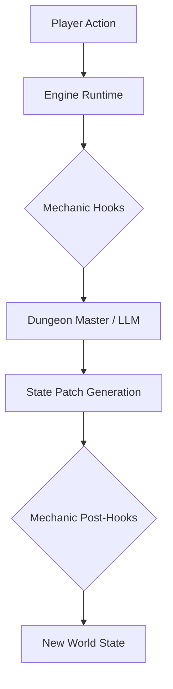

# Architecture Detail

OpenDungeon is built around the separation of engine runtime and game content. The core runtime provides the LLM bridge and turn-processing pipeline, while games are loaded as external plugins.

## Runtime Architecture

### Gateway vs Orchestrator

The project includes two types of engine runtimes:

1. **`apps/gateway`** (Stateful Server):
   - The primary entry point for users and front-end clients.
   - Manages persistence using Prisma and PostgreSQL.
   - Handles authentication, campaign metadata, and user profiles.
   - Recommended for single-instance or small-scale deployments.

2. **`apps/orchestrator`** (Stateless Runner):
   - A copy of the gateway runtime but without direct database dependencies.
   - Designed for scalability in a multiplayer environment.
   - One orchestrator instance can handle a single dedicated game session, reporting state back to the gateway.
   - Ideal for horizontal scaling (e.g., containerized per-session workers).

### Core Engine (`packages/engine-core`)

The Engine is the central orchestrator that manages the turn-based loop:
1. Receives player action.
2. Runs pre-processing hooks from mechanics.
3. Routes to the Dungeon Master (LLM) or specific mechanic actions.
4. Processes LLM responses into game state patches.
5. Runs post-processing hooks and returns the result.

---

## Package Roles & Dependencies

| Package | Role | Key Dependencies |
|---------|------|------------------|
| `shared` | Shared types and schemas | Zod |
| `content-sdk` | Interface for Game Modules | `shared` |
| `providers-llm` | AI model abstraction | - |
| `engine-core` | Turn runtime and DM logic | `shared`, `content-sdk`, `providers-llm` |
| `architect` | Content generation tools | `shared`, `providers-llm` |
| `devtools` | CLI project management | - |

---

## Game Modules

A **Game Module** is a standalone package (like `packages/game-classic`) that defines:
- **Mechanics**: Pluggable gameplay systems (e.g., combat, exploration, looting).
- **DM Config**: Prompt templates and behavior rules for the AI.
- **Content**: Static world definitions, classes, and initial states.

The engine loads the module from a local path via `GAME_MODULE_PATH` environment variable.

## Turn Pipeline Flow

